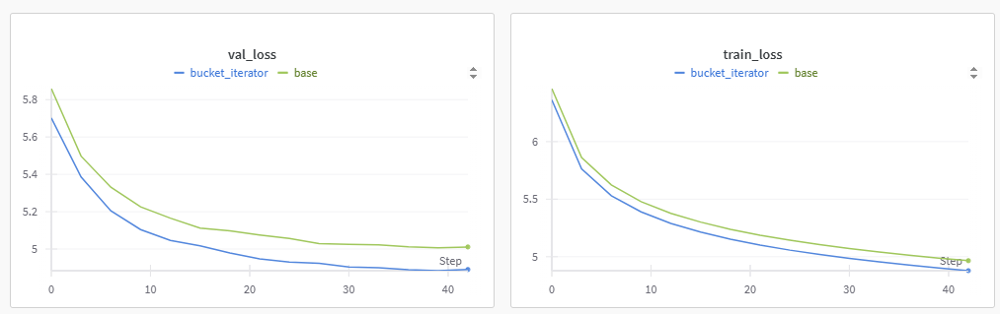

## Загрузка и работа с данными

В своей работе я много времени уделил экспериментам с данными и созданию комфортной экосистемы абстракций для работы с ними. Для сравнения можно открыть мой код из чекпоинта `dataset.py` и финальный код, и посмотреть, насколько далеко я продвинулся в работе с абстракциями над датасетом и загрузчиком.

Данные представляют собой набор из предложений из двух языков. Можно выделить два гиперпараметра модели, которые играют ключевую роль в баллансе между размерностью входных данных и доступной видеопамятью и временем работы. Эти два параметра - `vocab_size` и `max_lengh`.

55% Всех слов в `src` встречаются один раз. Это выглядит как серьезная цифра, однако доля эти слов в общей совокупности следующая

| кол-во повторений | доля в словаре | доля от всех слов |
| :------------------------------: | :------------------------: | :-----------------------------: |
|                1                |            55%            |              1.9%              |
|                2                |           13.64%           |              0.94%              |
|                3                |           6.65%           |              0.69%              |
|                4                |           3.94%           |              0.4%              |
|                <5                |           79.76%           |              4.07%              |

Для `trg` доля выглядит так:

| кол-во повторений | доля в словаре | доля от всех слов |
| -------------------------------- | -------------------------- | ------------------------------- |
| 1                                | 39.56%                     | 0.58%                           |
| 2                                | 13.83%                     | 0.4%                            |
| 3                                | 7.65%                      | 0.34%                           |
| 4                                | 5.14%                      | 0.3%                            |
| 5                                | 3.63%                      | 0.27%                           |
| <5                               | 66.17%                     | 1.62%                           |
| <6                               | 69.8%                      | 1.88%                           |

Я думаю оптимально для нашей задачи будет брать слова, встречающиеся 5 и более раз, это отсечет всего лишь 4% выборки, но при этом разительно понизит количество параметров в нашей модели и снизит время обучения, а также повысит обобщающую способность.

Второй параметр - `max_len`. Максимальный размер предложения. Я начинал с того, что не обрезал данные совсем и для `batch_size=32`. Получал время эпохи около 5 минут для `LSTM.` C 15млн параметрами, что довольно много, к тому же у меня постоянно заканчивалис 11 гигабайт видеопамяти, и видимо torch начинал двигать батчи туда-сюда и время эпох значительно увеличивалось.

Основные проблемы от оставления всех длин последовательностей появляются когда мы дополняем последвательности в батчах паддингами для парамельного умножения в `forward()`. Я решил протестировать идею сортировки данных по длине последовательностей в `src` и оставления последовательностей до 64. Я понимал, что возможно градиенты перестанут быть некоррелированными и модель может быстро переобучитбся на батчи, но все равно хотелось проверить сколько времени потратится на эпоху с таким подходом. И время эохи упало до 1м 45с, но моя модель быстро переобучилась и все стало плохо.

<pre class="vditor-reset" contenteditable="true" spellcheck="false">
    
</pre>

Остался только один вариант - мириться с тем, что надо обрезать значительную часть выборки, либо как-то делить предложения на несколько частей.

В выборке `src` длины последовательностей следующие

| длина  | доля потери слов |
| ----------- | ------------------------------ |
| $\leq$ 64 | 1.08%                          |
| $\leq$ 48 | 3.98%                          |
| $\leq$ 42 | 5.47%                          |
| $\leq$ 32 | 7.06%                          |

Я думаю оптимально брать около 48.

Я увидел, что в `torchtext` есть бакет итератор, который позволяет бороться с этой проблемой, и получилось реализовать мидлгрунд между полностью рандомными батчами и идеей выше. Как можно увидеть на графиках, градиенты не выглядят коррелированным и модель учится также как и с обычными .

Помимо открывшихся возможностей по использованию памяти, время обучение упало с 86 минут до 53, жаль, что я так поздно переоткрыл для себя идею с сортировкой длин.

## \<UNK\> и \<SUB\> и \<NUM\>

Первым в голову пришла идея заменять числа в переводе на числа в исходной последовательности, как универсальные токены, для этого был создан токен \<NUM\>.

В `src` : 761 числовых токеноы
В `trg` : 681

Это не много, но не испортит малины, дулжно чуть улучшить перевод и чуть сократить словарь, на практике BLEU не вырос, но идея кажется правильной.

Дальше я решил, что примерно в этот же класс токенов попадают абревиатуры и редкие содержащие цифры токены типа mark-2, которые я также буду прокидывать как и цифры, что тоже никак не повлияло на точность.

Про \<UNK\> я уже писал в части про инференс. Его я зануляю чтобы модель не предсказывала этот тип токенов вообще, также я пробовал удалять их из текста, что не дало значительного изменения в BLEU.

## BPE

Идея использовать разные токенизации для входа и выхода пришла мне в самом конце и я не успел ее отладить чтобы модель работала лучше, чем `spacy` для обоих языков. Но идея использовать `BPE` для немецкого кажется очень интуитивной и правильной из-за структуры языка - окончания, составные слова.
