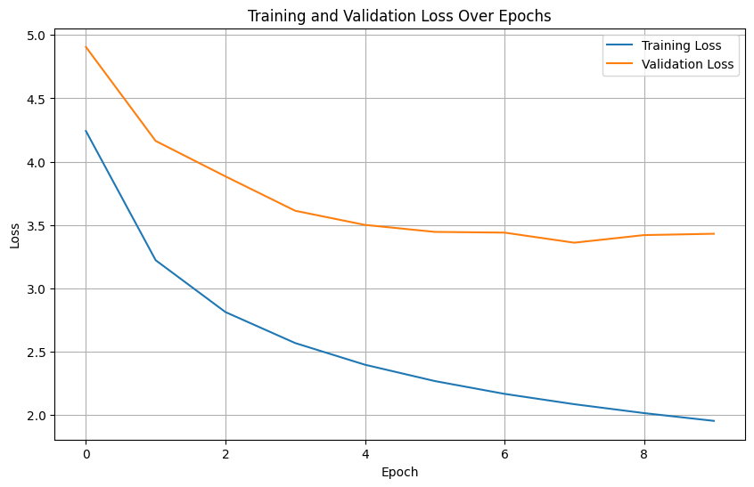

# Отчет о bhw2

## Загрузка и работа с данными

В своей работе я много времени уделил экспериментам с данными и созданию комфортной экосистемы абстракций для работы с ними. Для сравнения можно открыть мой код из чекпоинта `dataset.py` и финальный код, и посмотреть, насколько далеко я продвинулся в работе с абстракциями над датасетом и загрузчиком.

Данные представляют собой набор из предложений из двух языков. Можно выделить два гиперпараметра модели, которые играют ключевую роль в баллансе между размерностью входных данных и доступной видеопамятью и временем работы. Эти два параметра - `vocab_size` и `max_lengh`.

55% Всех слов в `src` встречаются один раз. Это выглядит как серьезная цифра, однако доля эти слов следующая

| кол-во повторений | доля в словаре | доля от всех слов |
| :------------------------------: | :------------------------: | :-----------------------------: |
|                1                |            55%            |              1.9%              |
|                2                |           13.64%           |              0.94%              |
|                3                |           6.65%           |              0.69%              |
|                4                |           3.94%           |              0.4%              |
|                <5                |           79.76%           |              4.07%              |

Для `trg` доля выглядит так:

| кол-во повторений | доля в словаре | доля от всех слов |
| -------------------------------- | -------------------------- | ------------------------------- |
| 1                                | 39.56%                     | 0.58%                           |
| 2                                | 13.83%                     | 0.4%                            |
| 3                                | 7.65%                      | 0.34%                           |
| 4                                | 5.14%                      | 0.3%                            |
| 5                                | 3.63%                      | 0.27%                           |
| <5                               | 66.17%                     | 1.62%                           |
| <6                               | 69.8%                      | 1.88%                           |

Я думаю оптимально для нашей задачи будет брать слова, встречающиеся 5 и более раз, это отсечет всего лишь 4% выборки, но при этом разительно понизит количество параметров в нашей модели и снизит время обучения.

Второй параметр - `max_len`. Максимальный размер предложения. Я начинал с того, что не обрезал данные совсем и для `batch_size=32`. Получал время эпохи около 5 минут для `LSTM.` C 15млн параметрами, что довольно много, к тому же у меня постоянно заканчивалис 11 гигабайт видеопамяти, и видимо torch начинал двигать батчи туда-сюда и время эпох значительно увеличивалось.

Основные проблемы от оставления всех длин последовательностей появляются когда мы дополняем последвательности в батчах паддингами для парамельного умножения в `forward()`. Я решил протестировать идею сортировки данных по длине последовательностей в `src` и оставления последовательностей до 64. Я понимал, что возможно градиенты перестанут быть некоррелированными и модель может быстро переобучитбся на батчи, но все равно хотелось проверить сколько времени потратится на эпоху с таким подходом. И время эохи упало до 1м 45с, но моя модель быстро переобучилась и все стало плохо.



Остался только один вариант - мириться с тем, что надо обрезать значительную часть выборки, либо как-то делить предложения на несколько частей.

В выборке `src` длины последовательностей следующие

| длина  | доля потери слов |
| ----------- | ------------------------------ |
| $\leq$ 64 | 1.08%                          |
| $\leq$ 48 | 3.98%                          |
| $\leq$ 42 | 5.47%                          |
| $\leq$ 32 | 7.06%                          |

Я думаю оптимально брать около 48

### Цифры

В `src` : 761 числовых слов

В `trg` : 681

## LSTM

Архитектура, которую я обучил к чекпоинту лежит в файле `lstm.py`.

У меня не сохранились графики обучения и ошибки до этой модели, но они не сильно интересны, так как только на ней я пробил 20 BLEU4.

<pre class="vditor-reset" placeholder="" contenteditable="true" spellcheck="false"><p data-block="0"></p></pre>

У модели следующая архитектура:

```python
  (src_embedding): Embedding(55315, 64)
  (trg_embedding): Embedding(34047, 64)
  (encoder): LSTM(64, 128, num_layers=2, batch_first=True, dropout=0.1, bidirectional=True)
  (encoder_output_proj): Linear(in_features=256, out_features=128, bias=True)
  (decoder): LSTM(64, 128, num_layers=2, batch_first=True, dropout=0.1)
  (encoder_hidden_proj): (
    (0-1): 2 x Linear(in_features=256, out_features=128, bias=True)
  )
  (encoder_cell_proj): (
    (0-1): 2 x Linear(in_features=256, out_features=128, bias=True)
  )
  (fc): Linear(in_features=256, out_features=34047, bias=True)
```

Внутри форварда я проецирую долговременную и краткосрочную память двунаправленного енкодера (`hidden`, `cell`) в пространство однонаправленного декодера и применяю некоторое подобие внимания:

```python-repl
# attention
energy = torch.bmm(decoder_outputs, encoder_outputs.transpose(1,2))  
attention = F.softmax(energy,dim=-1)
context = torch.bmm(attention, encoder_outputs)
combined = torch.cat([decoder_outputs, context],dim=2)
logits = self.fc(combined)
```

в `energy` лежит тензор скалярных проихведений векторов декодера, который мы нормируем и с этими весами берем спроецированный выход енкодера как контекст. Дальше проецируем объединение этих тензоров в логиты.

## Оптимизация teacher forcing

| Name                                                                        | Self CPU % | Self CPU  | CPU total % | CPU total | CPU time avg | Self CUDA | Self CUDA % | CUDA total | CUDA time avg | # of Calls |
| --------------------------------------------------------------------------- | ---------- | --------- | ----------- | --------- | ------------ | --------- | ----------- | ---------- | ------------- | ---------- |
| `aten::copy_`                                                             | 28.86%     | 5.878s    | 28.86%      | 5.878s    | 133.093us    | 10.713s   | 46.42%      | 10.713s    | 242.559us     | 44166      |
| `aten::to`                                                                | 0.11%      | 21.962ms  | 27.01%      | 5.502s    | 603.553us    | 19.197ms  | 0.08%       | 6.505s     | 713.577us     | 9116       |
| `aten::_to_copy`                                                          | 0.23%      | 46.282ms  | 26.91%      | 5.480s    | 2.149ms      | 11.916ms  | 0.05%       | 6.486s     | 2.543ms       | 2550       |
| `autograd::engine::evaluate_function: struct torch::autograd::CopySlices` | 0.19%      | 39.422ms  | 2.11%       | 429.041ms | 191.195us    | 7.573ms   | 0.03%       | 3.998s     | 1.782ms       | 2244       |
| `struct torch::autograd::CopySlices`                                      | 0.49%      | 100.022ms | 1.91%       | 389.619ms | 173.627us    | 31.028ms  | 0.13%       | 3.991s     | 1.778ms       | 2244       |
| `aten::linear`                                                            | 0.35%      | 71.396ms  | 1.58%       | 321.578ms | 116.768us    | 21.630ms  | 0.09%       | 2.392s     | 868.514us     | 2754       |
| `aten::addmm`                                                             | 0.62%      | 125.736ms | 0.67%       | 137.476ms | 51.839us     | 2.319s    | 10.05%      | 2.323s     | 876.102us     | 2652       |
| `autograd::engine::evaluate_function: AddmmBackward0`                     | 0.53%      | 108.503ms | 2.53%       | 515.485ms | 194.376us    | 22.751ms  | 0.10%       | 1.872s     | 706.038us     | 2652       |
| `AddmmBackward0`                                                          | 0.49%      | 99.115ms  | 1.61%       | 327.481ms | 123.485us    | 30.174ms  | 0.13%       | 1.684s     | 634.888us     | 2652       |
| `autograd::engine::evaluate_function: CudnnRnnBackward`                   | 1.06%      | 215.889ms | 16.16%      | 3.292s    | 1.403ms      | 38.598ms  | 0.17%       | 1.665s     | 709.835us     | 2346       |

---

Для сравнения таблица для обычного форварда:

| Name                                                              | Self CPU % | Self CPU  | CPU total % | CPU total | CPU time avg | Self CUDA | Self CUDA % | CUDA total | CUDA time avg | # of Calls |
| ----------------------------------------------------------------- | ---------- | --------- | ----------- | --------- | ------------ | --------- | ----------- | ---------- | ------------- | ---------- |
| `autograd::engine::evaluate_function: AddmmBackward0`           | 0.33%      | 16.051ms  | 1.90%       | 93.427ms  | 183.190us    | 3.200ms   | 0.06%       | 938.012ms  | 1.839ms       | 510        |
| `AddmmBackward0`                                                | 0.41%      | 19.957ms  | 1.36%       | 66.563ms  | 130.516us    | 5.264ms   | 0.10%       | 820.590ms  | 1.609ms       | 510        |
| `aten::mm`                                                      | 0.63%      | 30.851ms  | 0.63%       | 30.851ms  | 23.267us     | 818.848ms | 15.57%      | 818.848ms  | 617.532us     | 1326       |
| `aten::linear`                                                  | 0.24%      | 11.580ms  | 1.50%       | 73.622ms  | 120.297us    | 3.487ms   | 0.07%       | 727.171ms  | 1.188ms       | 612        |
| `enumerate(DataLoader)#_SingleProcessDataLoaderIter._next_data` | 1.04%      | 51.007ms  | 29.59%      | 1.453s    | 14.244ms     | 594.000us | 0.01%       | 712.701ms  | 6.987ms       | 102        |
| `aten::pad_sequence`                                            | 10.67%     | 524.009ms | 28.46%      | 1.398s    | 6.851ms      | 145.432ms | 2.76%       | 712.075ms  | 3.491ms       | 204        |
| `aten::addmm`                                                   | 0.47%      | 23.056ms  | 0.50%       | 24.696ms  | 48.423us     | 704.618ms | 13.40%      | 705.381ms  | 1.383ms       | 510        |
| `autograd::engine::evaluate_function: CudnnRnnBackward`         | 0.15%      | 7.512ms   | 7.63%       | 374.743ms | 1.837ms      | 648.000us | 0.01%       | 570.837ms  | 2.798ms       | 204        |
| `CudnnRnnBackward0`                                             | 0.10%      | 5.078ms   | 7.48%       | 367.231ms | 1.800ms      | 637.000us | 0.01%       | 570.189ms  | 2.795ms       | 204        |
| `aten::_cudnn_rnn_backward`                                     | 5.86%      | 287.620ms | 7.38%       | 362.154ms | 1.775ms      | 508.806ms | 9.67%       | 569.552ms  | 2.792ms       | 204        |
