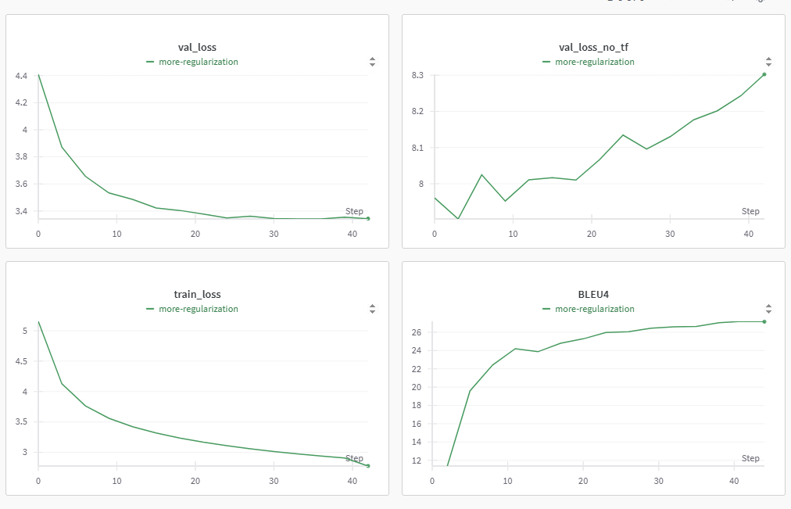

# Эксперименты с гиперпараметрами

Гипермараметры полностью определяют траекторию обучения моей модели. Вот их полный список:

```python
config = {
    'max_len': 48,
    'min_freq_src': 5,
    'min_freq_trg': 5,
    'max_freq_sub': 8,

    'bpe_vocab_size': 25000,

    'embedding_dim': 192,
    'hidden_size': 384,
    'num_layers': 3,

    'num_epochs': 18,
    'weight_decay': 1e-4,
    'label_smoothing': 0.2,

    'dropout_emb': 0.15,
    'dropout_enc': 0.2,
    'dropout_dec': 0.2,

    'dropout_attention': 0.1,

    'learning_rate': 1e-3,
    'lr_manual_decrease': False,
    'amsgrad': False,

    'gamma': 0.5,
    'patience': 1,
    'threshold': 1e-3,
    'batch_size': 128,

    'use_tf': False,
    'tf_from_epoch': 0,
    'tf_start': 0.9,
    'tf_decrease': 0.02
}
```

## Model

### Embedding dim и Hidden size

Интуитивно кажется, что размерность скрытого слоя должна быть хотя бы в три раза больше чем размерность одного токена, так как количество информации в слепке целого предложения должно сильно превышать информацию от одного токена, но на практике соотношение 1 : 2 показало себя наилучшим образом.

### Layers

Я не экспериментировал с этим параметров после того, как пронал пару ранов с 4 слоями и не получил никакого результата кроме увеличения времени работы, но возможно модель еще можно скейлить, так как ошибки на валидации и трейне моей финальной модели стоят довольно близко, а значит модель не переобучается.

### Dropouts

Введение дропаутов после скейлинрг модели до 3 слоев и 36 миллионов параметров дало очень хорошее улучшение в обобщении и полностью убрало переобучение.

## Optimizer

### `lr_manual_decrease`

Опытным путем я выяснил, что старт с высокого лернинг рейта и понижение вручную отрицательно вляет на ход обучения модели, так как AdamW хорошо сам справляется с выстаиванием лернинг рейтов конкретный параметров даже на ранних стадиях.

### `amsgrad`

Использование этого параметра также привело к небольшому замедлению процесса обучения, хотя на бумаге параметр выглядит как хорошее стабилизирующее дополнение.

### `learning_rate`

Опытным путем я остановился на этом `lr` еще в начале тренировки моделей и с тех пор не пробовал экспериментировать к его регулировкой.

### `weight_decay`

Увеличение этого параметра не дает видимого улучшения в ошибке на трейне и валидации, но почему-то сильно снижает BLEU.

*Параметр, который я случайно увеличил до 1e-3 в ране вместе с другими изменениями и потом пол дня не мог найти причину, почему при идентичной кривой val_loss и train_loss BLEU упирается в потолок в 22 вместо 28.*

## Scheduler

### `gamma`, `patience`, `threshold`

Все эти параметры подбирались методом пристального взгляда на график лоссов модели.

## Teacher forcing

Очень много времени было потрачено в попытках заставить хотя бы не ухудшать качество перевода от снижения `teacher_forcing`, но модель не только ухудшается при снижении teacher_forcing, но и кросс-энтропия на валидации с `teacher_forcing=0` монотонно растет при обучении.

