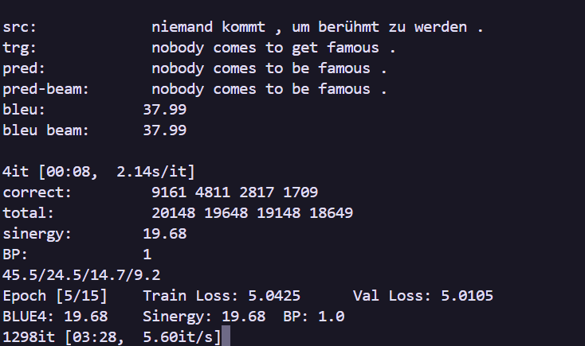

# Процесс обучения модели LSTM_3

## Основные этапы обучения

1. **Инициализация**:
   - `Vocab` для src и trg
   - `TranslationDataset` с данными
   - Инициализация модели (`LSTM_3`) с параметрами из конфига
   - Определение функции потерь (`CrossEntropyLoss`) и оптимизатора (`AdamW`)

2. **Цикл обучения**:
   - Для каждой эпохи:
     - Обучение на тренировочных данных с использованием `teacher forcing`
     - Валидация на тестовых данных с и без `teacher forcing`
     - Логирование метрик (loss, BLEU, sinergy) в `wandb`
     - Динамическая регулировка learning rate через `ReduceLROnPlateau` и scheduler
     - Сохранение чекпоинтов модели
     - Периодический вывод примеров перевода для визуальной оценки качества

## Особенности реализации

### Teacher Forcing

*см. главу teacher forrcing*

- **Динамическое изменение**:
  - Начальное значение `teacher_forcing = 1.0`
  - Уменьшение после определенной эпохи (`tf_from_epoch`) с шагом `tf_decrease`
- **Использование**:
  - Включение/выключение через конфигурацию (`use_tf`)
  - Влияет на передачу правильных токенов в декодер во время обучения

### Регуляризация и оптимизация

- **Clip gradients**: клиппинг градиентов (`clip_grad_norm_`) для стабилизации
- **Label smoothing**: Сглаживание меток в функции потерь для улучшения обобщения
- **Learning rate scheduling**:
  - `ReduceLROnPlateau`
  - Реулировка вручную (`lr_manual_decrease`) через умножение на константу *(сделано чтобы ускорять сходимость на начальных этапах, но без этого AdamW справляется даже лучше)*

### Сохранение и загрузка

- **Чекпоинты**:
  - Сохранение модели каждую эпоху после шестой
  - Именование файлов с учетом конфигурации и количества параметров. *Десятки весов до сих пор лежат у меня локально, так что если кому-то нужны веса модели, которая выдает 20 bleu и учится 10 минут, можете мне написать, я вам вышлю 100мб файл.*
- **Загрузка весов**:
  - Возможность загрузки предобученных весов через конфигурацию *(сделано чтобы не ломать мебель после того, как на 6 эпохе при попытке снизить тичер форсинг все слетало после небольших фиксов, сделаных краем глаза, или перепараметрицазии bleu, которая долгове время считалась только после 6 эпохи)*

## Ключевые параметры

- **batch_size**: Размер батча (по умолчанию 128)
- **num_epochs**: Количество эпох обучения
- **learning_rate**: Начальный learning rate
- **weight_decay**: Коэффициент L2-регуляризации
- **label_smoothing**: Параметр сглаживания меток
- **patience**: Кол-во эпох без улучшения для уменьшения learning rate
- **gamma**: Фактор уменьшения learning rate
